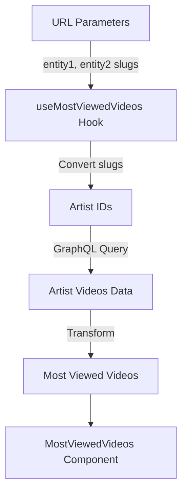

# Most Viewed Videos Comparison Feature

This document outlines the implementation of the most viewed videos comparison feature in the artist comparison section.

## Overview

The feature allows users to compare the most viewed YouTube videos between two artists, displaying:

- Video thumbnails
- Video titles
- View counts
- Artist names
- A visual comparison bar showing relative view counts

## Implementation Details

### 1. Data Flow



### 2. Key Components

#### `useMostViewedVideos` Hook (`src/hooks/graphql/use-most-viewed-videos.ts`)

- Retrieves artist slugs from URL parameters
- Converts slugs to artist IDs using `getArtistId`
- Makes GraphQL queries to fetch videos for both artists
- Processes and sorts videos by view count
- Returns the most viewed video for each artist

```typescript
interface VideoData {
  title: string;
  thumbnailUrl: string;
  views: number;
  artistName: string;
}
```

#### GraphQL Query (`src/graphql/queries/videos.ts`)

Uses the existing `GET_ARTIST_VIDEOS` query:

```graphql
query GetArtistVideos($id: ID!) {
  artist(id: $id) {
    id
    name
    artist_videos {
      video_id
      videos {
        id
        title
        video_id
        platform
        view_count
        thumbnail_url
        published_at
      }
    }
  }
}
```

### 3. Data Processing

1. **Slug to ID Conversion**

   - Uses `getArtistId` function to convert URL slugs to artist IDs
   - Handles loading states during conversion

2. **Video Data Transformation**

   ```typescript
   const allVideos = artistVideos
     .map((av) => av.videos)
     .filter((video) => video && video.view_count)
     .sort((a, b) => parseInt(b.view_count) - parseInt(a.view_count));
   ```

3. **View Count Formatting**
   - Uses the `formatNumber` utility to display view counts in a readable format
   - Example: "2.8M views" instead of "2,800,000 views"

### 4. UI Components

- **Video Cards**: Display video thumbnails and metadata
- **Comparison Bar**: Visual representation of relative view counts
- **Loading States**: Shows loading indicators during data fetching
- **Error Handling**: Displays error messages if data fetching fails

## Usage

The feature is automatically loaded in the artist comparison page when two artists are selected:

```typescript
// In CompareContainer
<section className="space-y-4">
  <div className="flex items-center gap-2">
    <div className="h-8 w-1 bg-blue-500/30 rounded-full" />
    <h2 className="text-2xl font-semibold">
      Most Viewed YouTube Video Alltime
    </h2>
  </div>
  <MostViewedVideos />
</section>
```

## Dependencies

- Apollo Client for GraphQL queries
- Next.js for routing and URL parameters
- Supabase for artist ID lookups
- Tailwind CSS for styling
