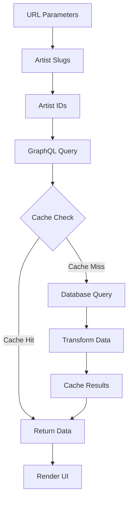

# Similar Artists GraphQL Migration

This document outlines the implementation of similar artists functionality using GraphQL, including both the artist details page and comparison features.

## Schema Definition

```graphql
type SimilarArtist {
  id: ID!
  name: String!
  similarity_score: Float!
  image_url: String
  genres: [String!]!
}

type ArtistConnection {
  artist: Artist!
  similarArtists: [SimilarArtist!]!
}

extend type Query {
  artistConnections(ids: [ID!]!): [ArtistConnection!]!
}
```

## Database Schema

The similar artists data is stored in the following tables:

```sql
-- similar_artists table
CREATE TABLE similar_artists (
  artist1_id UUID REFERENCES artists(id),
  artist2_id UUID REFERENCES artists(id),
  similarity_score FLOAT,
  PRIMARY KEY (artist1_id, artist2_id)
);
```

## Implementation Details

### 1. GraphQL Resolver

The resolver handles two main cases:

- Single artist similar artists (artist details page)
- Multiple artist connections (comparison page)

Key features:

- Redis caching with TTL
- Efficient Supabase joins
- Error handling
- Data transformation

```typescript
// Example resolver implementation
const resolvers = {
  Query: {
    artistConnections: async (_parent: unknown, { ids }: { ids: string[] }) => {
      // Implementation details in src/app/api/graphql/route.ts
    },
  },
};
```

### 2. Custom Hook

The `useArtistConnections` hook (`src/hooks/graphql/use-artist-connections.ts`) provides:

- URL parameter handling
- Artist ID resolution from slugs
- GraphQL query execution
- Loading and error states
- Type-safe data access

Usage example:

```typescript
const { connections, isLoading, error } = useArtistConnections();
```

### 3. Component Integration

The `TopConnections` component (`src/components/features/compare/top-connections.tsx`) features:

- Responsive grid layout
- Loading states with skeleton UI
- Error handling
- Genre display
- Similarity score visualization

## Data Flow

1. URL Parameters → Artist Slugs
2. Slugs → Artist IDs
3. IDs → GraphQL Query
4. Query → Database (with caching)
5. Response → UI Rendering



## Caching Strategy

- Cache key format: `similar_artists:{artist_id}`
- TTL: 1 hour (configurable in `CACHE_TTL.ARTIST`)
- Cache invalidation on artist updates

## Error Handling

1. URL Parameter Validation

   - Missing parameters
   - Invalid slugs

2. Data Fetching

   - Failed ID resolution
   - GraphQL query errors
   - Database errors

3. UI Feedback
   - Loading states
   - Error messages
   - Empty states

## Type Safety

Complete TypeScript interfaces for:

- GraphQL schema types
- Component props
- Hook return types
- Database results

## Performance Considerations

1. Query Optimization

   - Limited to 5 similar artists per query
   - Essential fields only
   - Efficient joins

2. Caching

   - Redis for frequent access
   - Appropriate TTL values
   - Cache warming strategies

3. UI Performance
   - Skeleton loading
   - Lazy loading images
   - Efficient re-renders

## Testing

1. Unit Tests

   - Hook behavior
   - Data transformation
   - Error handling

2. Integration Tests

   - GraphQL resolver
   - Cache interactions
   - Component rendering

3. E2E Tests
   - Full user flow
   - Error scenarios
   - Loading states

## Migration Steps

1. Schema Updates

   - Add GraphQL types
   - Implement resolvers
   - Configure caching

2. Frontend Implementation

   - Create custom hook
   - Update components
   - Add error handling

3. Testing & Validation
   - Verify data flow
   - Test edge cases
   - Performance monitoring

## Rollback Plan

1. Keep legacy implementation
2. Feature flags for gradual rollout
3. Monitoring and alerts
4. Quick reversion process

## Future Improvements

1. Enhanced Features

   - Pagination
   - Filtering by genre
   - Sorting options

2. Performance

   - Query optimization
   - Cache strategies
   - Batch loading

3. UI/UX
   - Advanced visualizations
   - Interactive elements
   - Accessibility improvements
